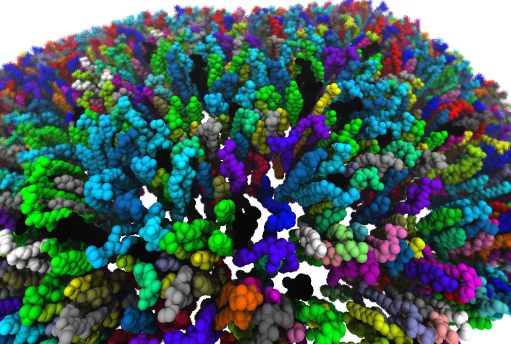
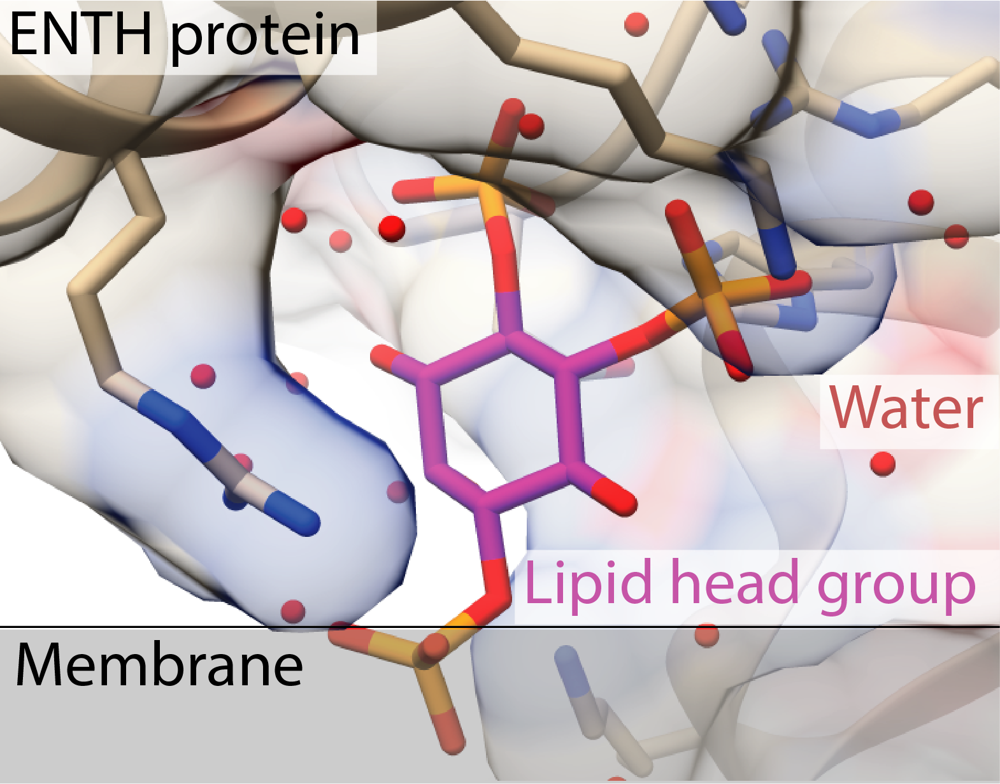

## Use simulations to understand the formation of domains in realistic membrane models
\textcolor{Maroon}{The goal of this aim is to construct quantitative models of physiological membranes and understand the physical mechanisms that drive the lateral segregation of lipid species.}

The primary function of a membrane is to separate what is outside from what is inside.
In simple organisms, the plasma membrane is a partition between the complex, and sometimes delicate, molecules required for life from the harsh environment.
Mammalian plasma membranes are a rich mixture of hundreds of types of phospholipids intermingled with other types of lipids, sterols, and proteins.
The fact that only the inner leaflet of eukaryotic cells contains the acidic phospholipids under physiological conditions results in a significant negative surface charge density. 
Mobile counterions and proteins in the cytoplasm are drawn to the inner leaflet of the plasma membrane, forming both specific and non-specific interactions with membrane constituents, leading to potentially significant alterations in membrane structure including the formation of membrane curvature and surface patterning. 
A major factor in intracellular signal transduction is the change in phospholipid-protein binding accompanying changes in the lateral distribution of lipids in the bilayer.
Lipid redistribution can act as a switch to turn on or off protein functions without a net change in lipid synthesis or degradation.

{#fig:membrane-setup .figure wwidth=2.5in wpos=R}
 
Despite advances in super-resolution microscopy, such as PALM and STORM, *in vivo* characterization of membrane heterogeneity remains challenging due to the high spatiotemporal resolution required to study fluctuating nanoscale assemblies of lipids and proteins in living cells and the need to chemically modify the lipids or bind them to ligands in order to visualize them or detect their motions and conformations by spectroscopy. 
However, a variety of indirect experimental techniques, often using fluorescently labeled lipid analogs, have characterized the existence of sub-micron sized domains in living cells and plasma membrane extracts [@doi:10.1021/bi010496c; @doi:10.1529/biophysj.105.070839; @doi:10.1042/BJ20091283; @doi:10.1529/biophysj.106.094730; @doi:10.1073/pnas.0611357104].
Even in the absence of proteins or chemical modifications, *in vitro* assays in the Janmey group have demonstrated clusters of negatively charged phospholipids of on the order of 50 nm after the addition of as little as 1 μM Ca^2+^ [@doi:10.1021/ja208640t].

My approach is to understand what conditions promote cluster formation and how the behavior of lipids in clusters differs from bulk. 
I will initially focus on delineating the nucleation of cation-induced clusters of anionic phospholipids. 
This work will involve extending the methods I developed to investigate single molecule QM/MM and all-atom nanoscale simulations. 
In those simulations, I found that Ca^2+^ can act as "molecular glue," forming aggregates of three lipids that remain together for at least 100 ns, much longer than other ion-lipid bond lifetimes. 
Extending beyond the all-atom simulations, I will use the [methods](https://github.com/biophyscode) we created to construct and equilibrate multi-component membrane systems to build models containing rich mixtures of phospholipids (Figure @fig:membrane-setup), going past typical two or three-component systems that are frequently used.

The finite and well-defined size of the domains suggests there is a balance between the mutual electrostatic and steric repulsion of negatively charged lipids and attraction mediated by counterions. 
I will monitor the extent of phase separation and demixing in simulations containing combinations of physiological divalent and monovalent ions with varying fractions of charged and uncharged lipids. 
The calculated diffusion coefficient inside the clusters can be compared with values obtained using fluorescence correlation spectroscopy (FCS) and spot variant FCS [@doi:10.1042/BJ20091283].
Simple, physical models based primarily on electrostatics [@doi:10.1016/j.bpj.2011.09.039] predict continual growth of clusters in the presence of excess counterions, yet *in vivo* clusters plateau at a stable size.
By using coarse-grained simulations and GPU-accelerated molecular dynamics, I will be able to study the growth and merging of clusters on the microsecond to millisecond timescale. 
The size and shape of the simulated clusters will be contrasted with those seen with AFM imaging and electron microscopy [@doi:10.1021/ja208640t].

Experiments pulling thin membrane tethers have shown that phase-separated phospholipid domains form precisely at the junction of highly curved regions [@doi:10.1073/pnas.0913997107], implying a relationship between membrane morphology an lipid sorting.
I will compare the bending modulus and mean curvature of clusters with data from pipette aspiration of membrane tubules [@doi:10.1073/pnas.0913997107; @doi:10.1042/BJ20091283; @doi:10.1073/pnas.0611357104].
The order parameter of lipids in and on the boundary of the cluster can be compared to results of complementary non-fluorescent methods, such as  EPR, NMR, and neutron scattering. 

{#fig:stereospecific .figure wwidth=2in wpos=L}

 Finally, I will study whether being in a cluster alters the ability of certain lipids to perform their biological roles. 
 Many of the lipids implicated in cluster formation, such as PtdIns(4,5)*P*~2~, have been shown to bind hundreds of proteins [@doi:10.1038/nrm2328], and several integral membrane proteins have been shown to partition into lipid raft-like domains [@doi:10.1016/j.bbamem.2018.05.002].
PtdIns(4,5)*P*~2~ binds (some) proteins in a highly stereospecific manner (Figure @fig:stereospecific) requiring a fully extended and accessible head group. 
In order to evaluate the biological consequences of clustering, I will run simulations containing proteins that bind through either non-specific, electrostatic attraction (e.g., N-WASP and gelsolin) or through tight coordination (e.g., the PH domain of PLCδ). 
I will test whether these proteins bind “free” lipid molecules as well as they bind clustered ones by using steered molecular dynamics.

I expect the outcome of studying domain formation to be especially helpful for building better models of plasma membranes that reflect the complex cellular environment. 
I anticipate these results could provide quantitative insights for pore-formation in cell membranes by toxins and cationic surfactants, the activation of integral ion channels and GPCRs by PtdIns(4,5)*P*~2~, and the dynamics of membrane fusion, fission and other buckling geometries.
