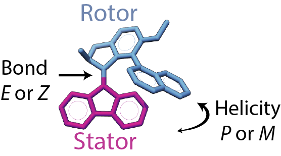

## What are the mechanical properties of synthetic molecular motors?

{#fig:motor-diagram .figure wwidth=2in wpos=L}

The ability of light-driven molecular motors to switch between two or more states makes them suitable for new forms of optical data storage [@doi:10.1007/s003390201338], as "wheels" on nano-scale cars [@doi:10.1038/nature10587], trains [@doi:10.1007/s12274-008-8041-4], worms [@doi:10.1021/ol703027h], and walkers [@doi:10.1039/c1cs15005g], or in new forms of responsive materials [@doi:10.1039/B101231M].
Unlike switches, whose work is reversed after every full cycle, molecular motors can be used to progressively move systems away from thermodynamic equilibrium [@doi:10.1039/c7cs00245a].
The synthetic molecular motors of Ben Fergina operate by converting light and heat into directional rotary motion.
These motors belong to a class of molecules called overcrowded alkenes, with two stable enantiomers, and adopt a helical shape due to steric strain around the central double bond.
The two sets of conjugated rings rotate relative to each other, with the central bond acting as an axle, and for simplicity, one set of rings is designated the "stator" while the other set is called the "rotor."
The directional motion of these molecules can be analyzed in terms of two degrees of freedom: $E$ to $Z$ for the isomerization of the double bond (analogous to *cis* and *trans*) and $P$ and $M$ for the overall twist or helicity of the molecule (Figure @fig:motor-diagram). 

### Calculate the speed, torque, and efficiency of motors
In 2006, it was shown that light driven molecular motors can rotate a glass rod that is more than 10,000 times their size upon irradiation with light and when included as a dopant in a liquid crystal film [@doi:10.1038/440163a].
While it is clear that artificial motors, when aligned appropriately so their individual effects are magnified, can produce macroscopic effects, it is not known how much force an individual molecular motor can generate. 
I will take the nonequilibrium model I developed to quantify directional motion in biological motors to these artificial molecular motors, in a new direction, focusing on the "second generation" class of motors from Ben Feringa and colleagues, which possess chemically symmetric stators and a lower energy for the thermal step.
 I will study the four ground states that comprise the 360$^\circ$ cycle depicted in Figure @fig:motors.
 On the left, the four structural states of the motor demonstrate movement of the upper rotor relative to the fixed stator through two photochemical ($1 \rightarrow 2, 3 \rightarrow 4$) and two thermal steps ($2 \rightarrow 3, 4 \rightarrow 1$).
 On the right, I've sketched illustrative free energy profiles along a given surface $E$ or $Z$; these represent the pattern of energy troughs and barriers for changing the helicity of the structure while maintaining the same orientation of the double bond, essentially sliding the bulky biaryl rings connected to the rotor past the stator.

 ![On the left, the four ground state conformations of a second generation motor, adapted from Štacko et al[@doi:10.1126/science.aam8808]. On the right, the same four states placed on free energy profiles. The energy profiles are periodic, with two cycles shown for both isomerization state. A clone of the lower $E$ energy surface is shown above, for clarity, to demonstrate the progression from state 4 to state 1 requires energy.](images/offset-barriers.png){#fig:motors width=100%}
 
Previously we used microsecond-scale molecular dynamics simulations to determine the energy landscapes based on equilibrium population distributions. 
However, because the barriers here are expected to be much larger, I will directly probe the potential surfaces by evaluating the energy of motor conformations for different values of the central dihedral angle.
I will perform this dihedral scan using a quantum chemistry package, such as [Psi4](http://psicode.org/) with density functional theory and semi-empirical methods.
I will begin with the semi-empirical methods PM3 or AM1 and test the sensitivity of the results to different quantum approaches (e.g., other types of DFT and Hartree-Fock) and basis sets (e.g., 6-31G*).
From the discrete free energy profiles, the rate of bin-to-bin transitions can be deduced, and these are gathered, together with the surface-to-surface transition rates, in a Markov matrix.
Solving for the eigenvectors of the matrix yields the nonequilibrium steady state (NESS) population in each photochemical state of the motor. 
From the NESS, I will calculate the net probability flux for the complete cycle ($1 \rightarrow 1$), as illustrated by the series of purple and orange arrows in Figure @fig:motors, for a given input level of light irradiation. 

### Optimize the design of artificial molecular motors
As demonstrated by Richard Feynman in a lecture on Brownian ratchets, the challenge of designing molecular motors is not how to create movement, but how to control the directionality of the omnipresent -- and random -- motion on the molecular scale [@doi:10.1038/nnano.2006.45].
This has been referred to as the “gating" of stochastic motion[@doi:10.1039/c7cc06683j].
In my previous work [@doi:10.1016/j.bpj.2018.02.008], I showed that the gating can arise purely from the complementary shape of two potential energy surfaces, whereby an unpassable barrier on one surface can be circumnavigated by motion on the other surface (see Figure S6, in particular.)
In this section, I will explore the relationship between the shape of the potential energy surfaces and the directionality of artificial molecular motors. 
This sub-aim will test the current understanding of motor mechanisms, most of which has been inferred through static structural snapshots and chemical intuition, using design proofs and will open the field of rational design to molecular rotors, pumps, transporters, and other nanorobotics.

It has been empirically determined that adding electron donating and electron withdrawing moieties has the potential to affect the rotation rate of the motor [@doi:10.1007/s00894-016-3085-y].
Polarizing the molecule by placing electron withdrawing and electron donating groups on either end of the central double bond, has the potential to lengthen the effective axle, significantly reducing the barrier for rotation. 
I will numerically optimize the potential energy surfaces that I determine in the previous sub-aim, to yield the maximum directional flux and maximum torque (see Figure @fig:COBYLA for an example). 
The surfaces will be modeled as splines with six to eight control points evenly spaced along the periodic degree of freedom and the spline points will be allowed to move as the optimization procedure runs. 
Based on preliminary work, this procedure affords ample room to significantly change the properties of the surfaces. 
I will couple the understanding that arises from this study with the knowledge of how chemical constituents affect overall rotation rates to suggest new avenues for synthetic motor design.

 {#fig:COBYLA width=100%}