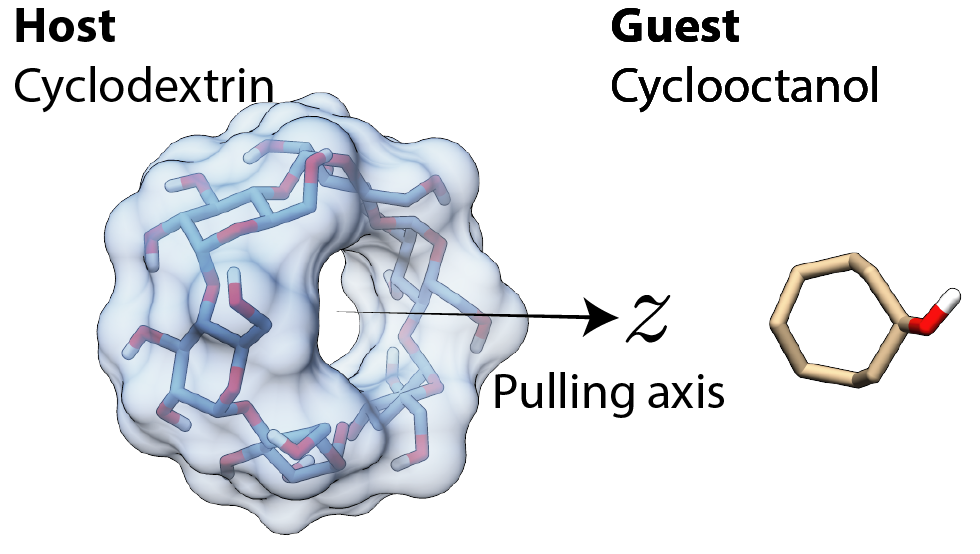
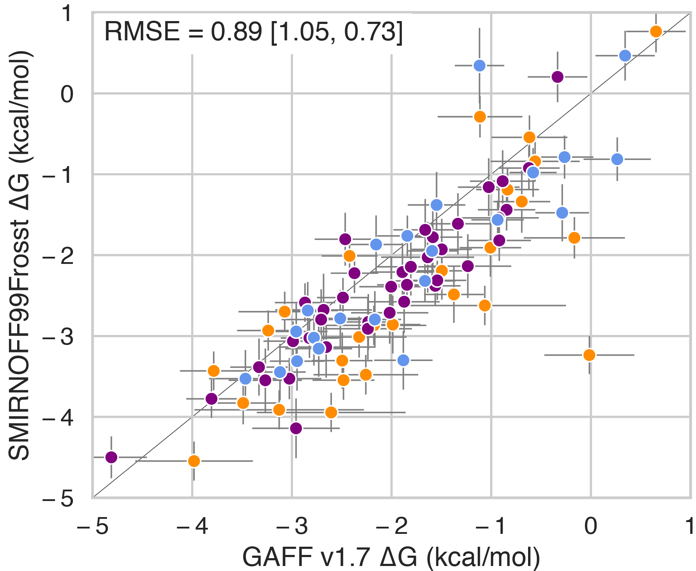

## Build advanced technologies to perform free energy calculations for drug design
*The proposed research in this aim will advance quantitative methods for molecular dynamics simulations and incorporate binding thermodynamics into a community-driven open access force field effort.*

Designing ligands that bind their target with high affinity and specificity is a key step in small-molecule drug discovery, yet can take upwards of three years owing to the fact it is often necessary to synthesize hundreds or thousands of new compounds.
In recent years, the pharmaceutical industry has begun to use absolute and relative binding free energy calculations to help narrow the number of compounds that must be synthesized [@doi:10.1007/s10822-016-9998-9; @doi:10.1021/ci4004199].
In particular, the advent of computational calorimetry has enabled quantitative and high-precision comparisons of binding free energies, enthalpies, and entropies (by subtraction) with experimental values determined by isothermal titration calorimetry or NMR [@doi:10.1021/acs.jctc.5b00405].
However, the errors associated with such calculations are still typically well above 1 kcal/mol [@doi:10.1007/s10822-017-0088-4], and even a modest improvement of the prediction accuracy by 1 kcal/mol would lead to a substantial decrease in the number of compounds that must be manually synthesized and tested [@tag:improvement].
The first goal of this aim is to create better tools for estimating protein-ligand binding constants.

 {#fig:apr .figure wwidth=3in wpos=L}

To develop better tools, I will begin by studying host-guest systems, nonconvalent complexes between a cavity-containing host and a small molecule guest, that have emerged as a powerful tool for evaluating free energy algorithms
The attach-pull-release (APR) method has consistently been ranked among the most accurate techniques for predicting binding thermodynamics host-guest complexes in blind challenges [@doi:10.1007/s10822-016-9974-4; @doi:10.1007/s10822-014-9735-1]. 
In APR, the reversible work of transferring the guest from the binding site to solution, via a physical pathway, is computed using a series of umbrella sampling windows (Figure @fig:apr).
In the “attach” phase, restraints are connected to the guest (and optionally, to the host for better conformational sampling) through a parameter $\lambda \in [0, 1]$ that controls the strength of the restraints.
During the “pull” phase, the equilibrium length of a distance restraint joining the guest and host is increased until the guest is no longer interacting with the host molecule. 
The “release” phase reverses the work of attaching the restraints and also corrects the concentration of the guest molecule to standard state.
Simulating each window and integrating over the partial derivative of the restraint energy with respect to the restraint target, we can generate a potential of mean force along the pulling coordinate that is used to compute the binding free energy at standard state, $\Delta G^\circ$.
One advantage of APR is a complete thermodynamic description of binding ($\Delta G^\circ$, $\Delta H$, and $-T \Delta S$) that are all absolute quantities for any protein-ligand pair instead of relative $\Delta G$ values along some chosen route of successive alchemical modifications that would be obtained through free energy perturbation methods.

As a post-doc, I created the Python interface to APR, named pAPRika, that can prepare, run, and analyze host-guest simulations.
In the coming years I will independently continue the development of pAPRika by transforming it into a generalized tool that is capable of computing free energies along any physical pathway, using either AMBER or the open source OpenMM as simulation packages.
The core functionality of pAPRika is already being used by research groups across the country and in at least one group in China.
An important milestone is adapting pAPRika for the efficient computation of protein-ligand binding free energies.
Due to the much larger size of proteins compared to host-guest complexes, the increased fluctuations in potential energy make $\Delta G^\circ$ much harder to converge.
A key step will be adding the ability to automatically allocate resources, by calculating the "return on investment" (ROI) in each window that reports how extra sampling in any $\lambda$ state affects the standard error of the mean binding affinity.
Efficient APR calculations are well suited to predict which ligands, among a series of potentially unrelated scaffolds and structures, will bind most tightly to a protein target, such as during virtual screening.

Even when results are well-converged, the accuracy of a free energy simulations is necessarily limited by the accuracy of the force field it uses. 
Most established small molecule force fields (e.g., the general AMBER force field, GAFF) have been tuned using pure liquid state data, such as the average density, enthalpy of vaporization, or the self-diffusion coefficient.
Over the past decade, it has become clear that reproducing those properties well does not guarantee binding thermodynamics at a level acceptable for guiding experiments.
The open force field group (OpenFF) is an academic collaboration that aims to develop new force fields using open access methods, open source software, and high-quality open data sets.
One central difference with the OpenFF group is the use of direct chemical perception to apply force field parameters based on a molecular graph instead of atom types[@doi:10.1101/286542], and the desire to avoid over-fitting parameters by making Monte Carlo moves in parameter space to find the fewest number of parameters required to describe a set of chemistries [@doi:10.26434/chemrxiv.6230627.v2].
The first prototype force field from this effort was release in June 2018, called SMIRNOFF99Frosst v0.1, based on a predecessor of GAFF.
SMIRNOFF99Frosst is able to perform as well as GAFF, and in some cases, alleviate conformational problems caused by GAFF's atom types, in only 335 parameter lines compared to the 6794 lines in GAFF version 2.1. 
Beyond this initial release, multiple generations of SMIRNOFF-based force fields are planned, incorporating new forms of Lennard-Jones interactions, the addition of atom polarizabilities, and Bayesian estimates to quantify systematic errors in the force field.

{#fig:smirnoff .figure wwidth=3in wpos=R}

As a member of the OpenFF consortium, I am responsible for benchmarking new iterations of SMIRNOFF-family force fields using host-guest thermodynamics computed by pAPRika.
Figure @fig:smirnoff shows the very first comparison of SMIRNOFF99Frosst v0.1 and GAFF v1.7 on host-guest systems.
GAFF v1.7 is known to overestimate binding affinities by >1 kcal/mol[@doi:10.1021/acs.jctc.7b00359], and it appears that SMIRNOFF99Frosst reduces this tendency.
To begin, I will use the "[benchmark set](https://escholarship.org/uc/item/9p37m6bq)" of Mobley et al.[@doi:10.1146/annurev-biophys-070816-033654].
There, experimental data are available for rigid curcurbituril and highly flexible cyclodextrin hosts with a variety of drug-like guest molecules. 
When available, I plan to incorporate the binding data resulting from selective derivatization of cyclodextrins designed to evaluate specific functional group interactions [@doi:10.26434/chemrxiv.5782224.v1].

To include pAPRika calculations in the creation of new force fields, I will leverage the ForceBalance framework of Wang et al.[@doi:10.1021/jz500737m]
ForceBalance uses thermodynamic fluctuation formulas and reference data to optimize an objective function, such as the sum of squared differences between the calculated and reference values.
I will extend my collaboration with Dr. Lee-Ping Wang and integrate pAPRika binding free energy calculations into the optimization loop of ForceBalance. 
I have experience working with the analytic derivatives of the binding free energy with respect to Lennard-Jones parameters [@doi:10.1021/acs.jpcb.5b04262], and using these derivatives to tune parameters was recently used by a colleague to optimize the TIP3P water model for binding calculations by post-processing existing MD trajectories for small parameter perturbation [@doi:10.1021/acs.jctc.8b00318].

Together, these methodological improvements will help create a transparent and robust set of metrics to evaluate the performance of candidate force fields on an equal footing.
By incorporating host-guest binding data, the degeneracy in parameter space will be broken, avoiding force fields that agree excellently with experiment for liquid properties and yet agree poorly on binding.
Improving the performance of force fields for predicting binding affinities will reduce the current five year timescale, and over $500 million cost, that it takes to bring drug candidates into preclinical trials.
I believe the ideas in this aim could be turned into an NIH proposal by demonstrating the need to systematically evaluate force field accuracy for protein-ligand binding, perhaps the most important application of this work for human health.